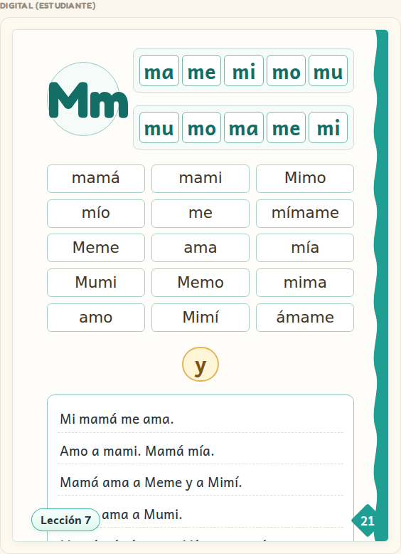
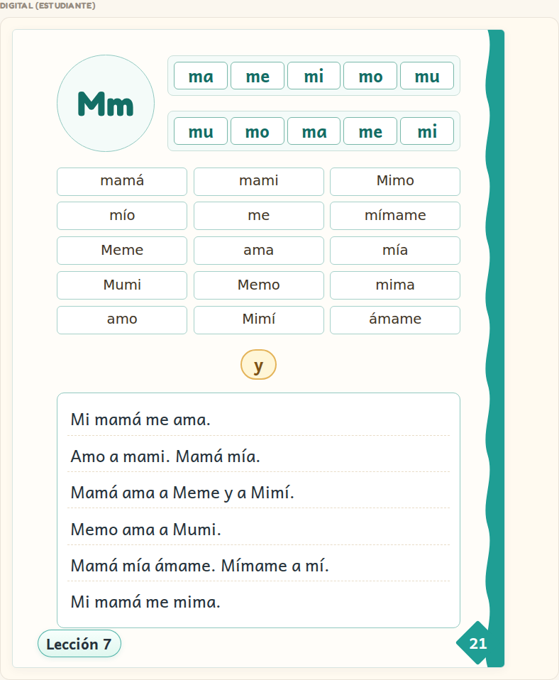
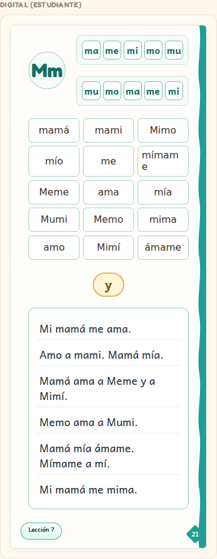
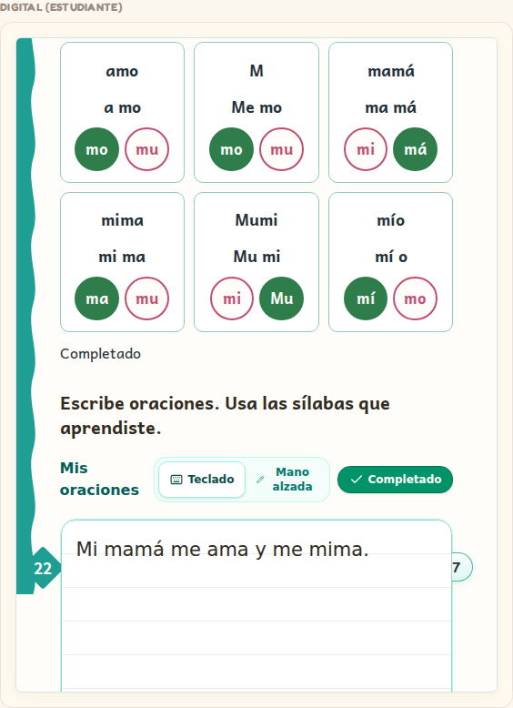
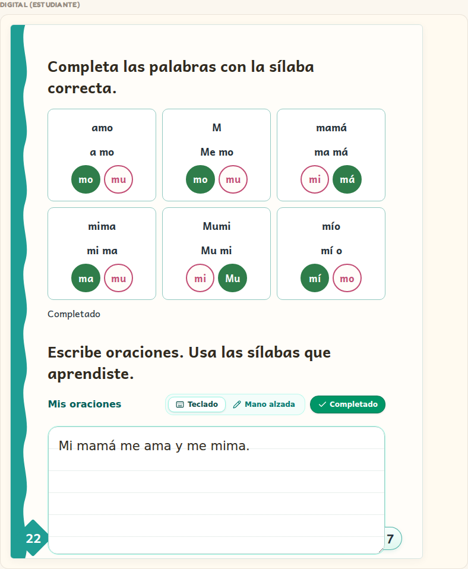
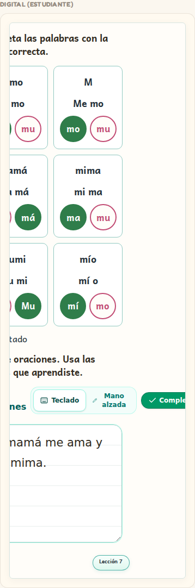
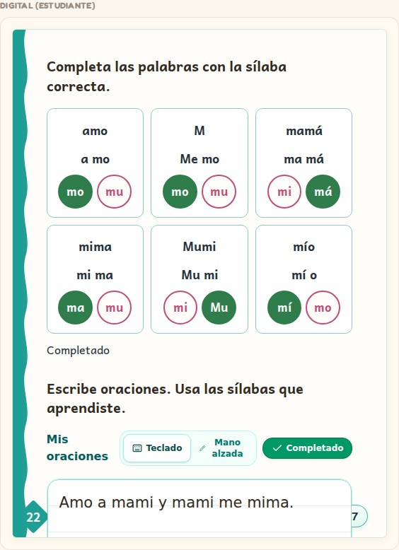

# Workbook Archetype Proof — Families 7 & 8

**Date:** 8 October 2026
**Scope:** Rendered proof and verification for Archetypes 7 (*Phonics / Reading Practice*) and 8 (*Complete-the-Word + Sentence Writing*).

---

## Executive Summary

Current `main` was verified for repeated Workbook exercise families 7 and 8 against physical source requirements (`WORKBOOK_ARCHETYPE_STANDARD.md`, `STUDENT_INTERACTION_STANDARD.md`).

All 7 verification suites in `tests/e2e/archetype-proof-7-8.spec.ts` passed cleanly in Chromium headless execution across laptop (1280px), tablet (820px), and mobile (390px) viewports.

---

## Inspection of Candidate PR #551 vs. Current Main

As instructed, existing PR #551 (`origin/feat/workbook-complete-word-sentence-writing-3745635064342274184`) was inspected as candidate evidence.

### Findings
1. **Current Main Status**: Current `main` already contains full production implementations for both Archetypes 7 and 8:
   - **Archetype 7 (`PHONICS_READING_PRACTICE`)**: Rendered in `FaithfulPageRenderer.tsx` with native font roles (`title`, `syllable-bubble`, `vocab-grid`, `sentence-line`, `reading-sentences`), correct column layouts, and non-cropping full-page containers.
   - **Archetype 8 (`COMPLETE_WORD_SENTENCE_WRITING`)**: Rendered via `InteractiveFillInBlank` (`InteractivePageExercises.tsx`) for syllable completion and `WorkbookWritingResponse` (`WorkbookWritingResponse.tsx`) for sentence handwriting/text entry.
2. **Feature Parity**: Current `main` includes drag-and-drop & direct-tap selection for complete-word exercises, dual-mode handwriting (`Teclado` typed guidelines and `Mano alzada` canvas tracing), explicit completion confirmation, and student-scoped persistence in `localStorage`.
3. **Dependencies / Defects**: No missing dependencies or required fixes were found that exist only in PR #551. Current `main` is complete and functional for Archetypes 7 & 8.

---

## Verification Criteria & Results

| Criteria | Verification Status | Notes |
| :--- | :---: | :--- |
| **Physical-source text preserved** | **PASSED** | Page 21 verified: Title (`Mm`), Syllables (`ma me mi mo mu`), Vocabulary (`mamá`, `mami`, `Mimo`, etc.), Sentences (`Mi mamá me ama.`, etc.). Page 22 verified: Instructions and 6 fill-in-blank items. |
| **Reading page hierarchy & no cropping** | **PASSED** | Uncropped layout hierarchy across laptop, tablet, and mobile. Full-page fallback containers maintain original proportions without cropping text or artwork. |
| **Complete-word interactions** | **PASSED** | `InteractiveFillInBlank` choices (`mo`, `má`, `ma`, `Mu`, `mí`) register clicks/drags, highlight correct completion, and emit Gretel events without punitive buzzers. |
| **Sentence handwriting / text entry** | **PASSED** | `WorkbookWritingResponse` supports `Teclado` (typed input on lined background) and `Mano alzada` (freehand canvas with color swatches & eraser). Completes via "Listo". |
| **Save / reload persistence** | **PASSED** | Student responses and completion status persist to `localStorage` and are fully restored after a page reload. |
| **Phone / Tablet / Laptop fit** | **PASSED** | Tested at 1280x900, 820x1180, and 390x844. Zero horizontal overflow (`scrollWidth <= innerWidth`). |
| **Visual integrity** | **PASSED** | All visible images loaded with `naturalWidth > 0`. Zero broken image URLs. |

---

## Rendered Screenshot Proofs

### Archetype 7: Phonics / Reading Practice (Page 21)

#### Laptop Viewport (1280px)


#### Tablet Viewport (820px)


#### Mobile Viewport (390px)


---

### Archetype 8: Complete-the-Word + Sentence Writing (Page 22)

#### Laptop Viewport (1280px)


#### Tablet Viewport (820px)


#### Mobile Viewport (390px)


#### Save / Reload Persistence Restored


---

## Test Execution Command

```bash
pnpm exec playwright test tests/e2e/archetype-proof-7-8.spec.ts --project=chromium
```
