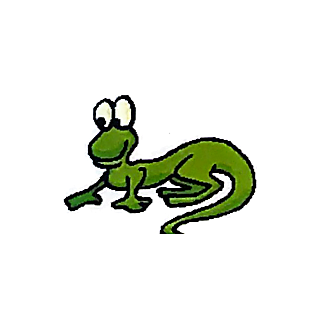
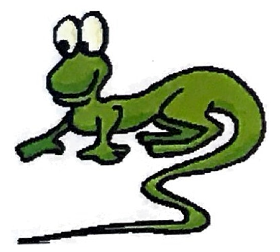
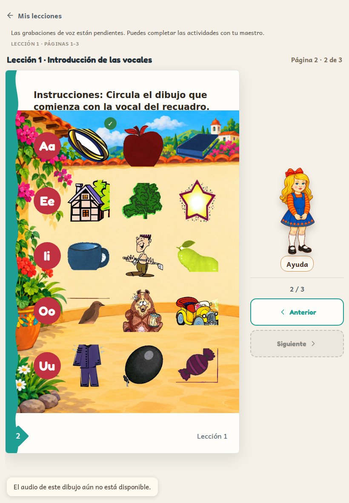
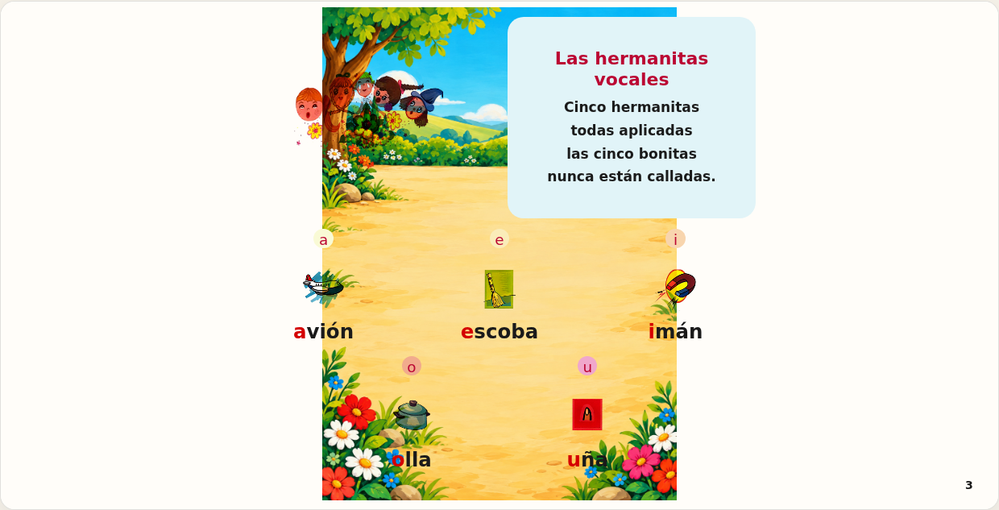

# Complete production asset integration

Owner authorized copying the 93 missing backgrounds, integrating with current app code, restoring eight delivery outputs, resolving Lala against source artwork, and publishing at a verified final checkpoint on 3 October 2026.

## Sources and scope

All 148 original background PNGs are installed at the paths already defined by `src/data/final-backgrounds.json`. SHA-256 values match the supplied final ZIP packages, including the lossless Flip Chart supplement. This includes the 55 files from the earlier integration branch and its 93 missing files. Workbook pages 86–87 have no delivered backgrounds and intentionally remain without one. Flip Chart printed pages 1–60 map to PDF sheets 3–62; front matter has no scenic background.

Integration uses the current main application at 1472516, preserving its student continuity, teacher tools, printing, audio and progress work. Background images are decorative, noninteractive, uniformly contained, and behind existing page content.

The eight 384/768 delivery outputs for águila, arco, carro and traje are restored by the existing preparation pipeline and committed for complete checkouts. A production asset verification script now checks all 477 required images (54 workbook, 167 Flip Chart, 148 backgrounds, 108 delivery outputs), decodes them, and checks delivered background hashes. The same script can verify an actual deployment's MIME types and exact bytes.

## Lala source correction

The previous `p024-lala.png` (SHA-256 `314e85e8731370105a83c8a636f17580d1f9421a6b159ee049065a6960309459`) cuts off the tail. Earlier standalone sources have the same defect. The verified repository source `public/cartilla/art/hd/flipchart/page-024.jpg` (PDF sheet 24 / printed page 22, 2550×3458) contains the entire illustration.

The replacement is a lossless PNG extraction of source pixels at left=1460, top=2730, width=550, height=495, including the entire tail and white padding. No redraw, recoloring, resampling or invented pixels. The existing source white background is retained. Source sheet and existing corrected page preview agree on the full tail. No other foreground image changed.

## Local verification

- Typecheck passed.
- Full unit suite: 117 files passed, 1496 passed tests and 2 expected failures.
- Production Vite build passed (existing bundle-size advisory only).
- All 477 required image files decode; all 148 background hashes match delivery.
- Four Chromium checks passed: workbook phone/tablet interactions and Flip Chart portrait/landscape, including background page mapping, decoded images, pointer safety and unchanged foreground bounds.
- Standards and spec reviews found no blocking findings.

Publication and live verification are a separate final checkpoint; local evidence alone is not a deployment claim.
