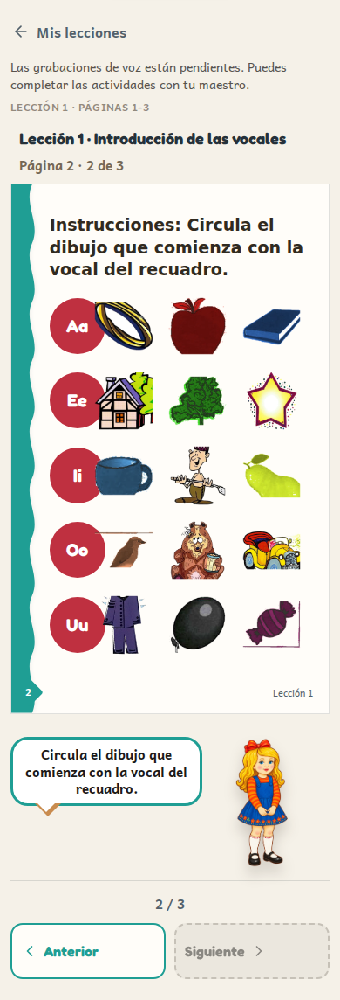
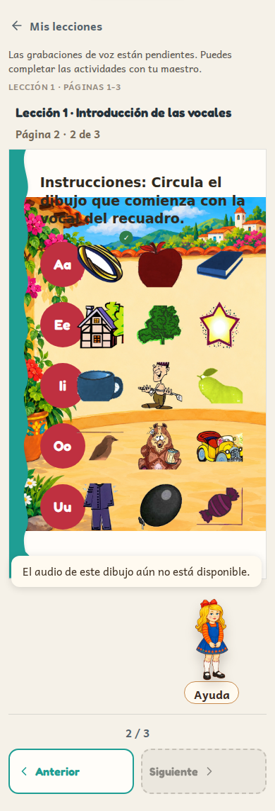
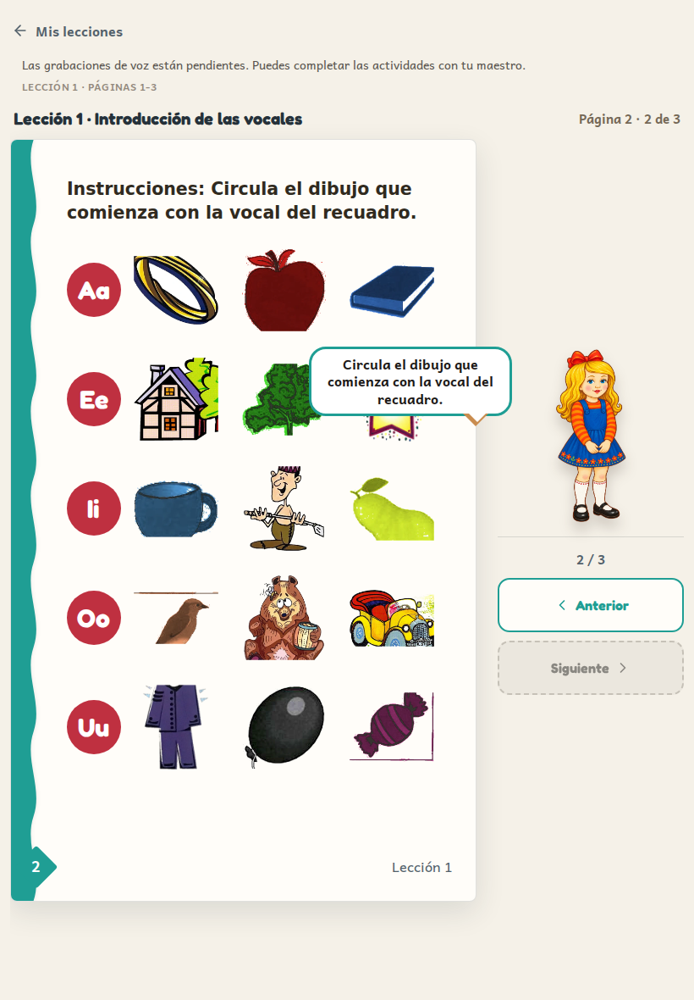
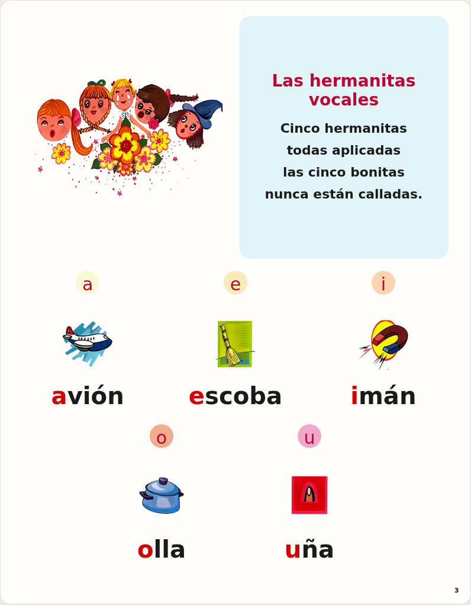
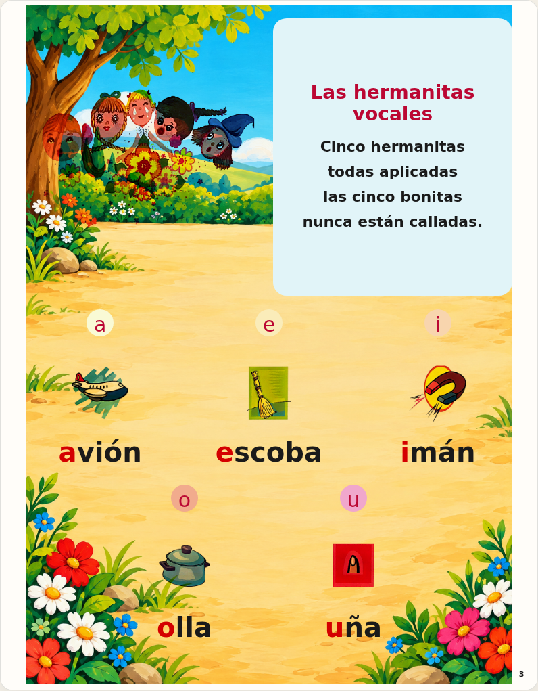
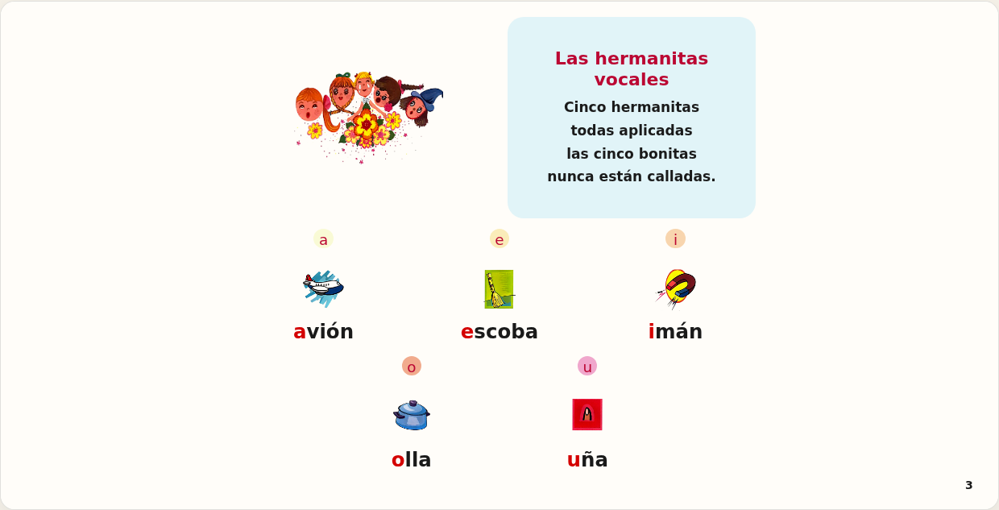

# Final background integration

All 148 delivered final backgrounds are connected: 88 Workbook pages
(printed 1–85 and 88–90) and 60 Flip Chart pages (printed 1–60, PDF sheets 3–62).
The supplemental FlipChart_Pages_010-020_and_040_Lossless ZIP fills the 12 gaps
in the first four ZIPs. No superseded image was substituted. Every PNG was
copied unchanged and checked against its delivery manifest SHA-256.

The single registry is `src/data/final-backgrounds.json`. Workbook keys are
printed pages; Flip Chart keys are PDF sheets and retain printed identity.
To replace an approved background, add its file under
`public/cartilla/backgrounds/final/` and update only its registry entry.

One decorative image layer serves existing Workbook frames, fixed-coordinate
pages and the native Flip Chart board. Uniform `contain` fitting preserves the
whole composition: no cropping or stretching. Different Flip Chart proportions
may leave paper margins. Original illustrations, text, targets, drawing/writing
areas, Gretel and page geometry remain unchanged. Backgrounds cannot receive
pointer events. Existing opaque Flip Chart page paper becomes transparent only
when that board has a delivered background. PR #433 scenery is not used.

Verification includes byte/hash checks for every image, registry completeness,
excluded pages, printed/PDF identity, page replacement, representative Workbook
phone/tablet and Flip Chart portrait/landscape browser proof. The browser checks
compare foreground geometry with backgrounds hidden/shown and test actual
picture taps. Before/after screenshots below retain the same original content.

| Surface | Without background | With final background |
|---|---|---|
| Workbook phone |  |  |
| Workbook tablet |  |  |
| Flip Chart portrait |  |  |
| Flip Chart landscape |  |  |
