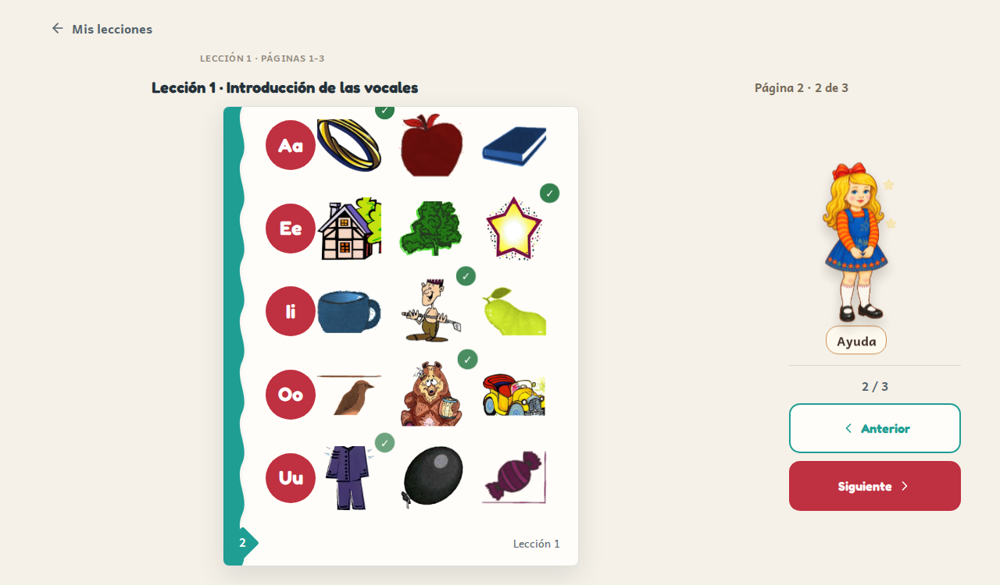
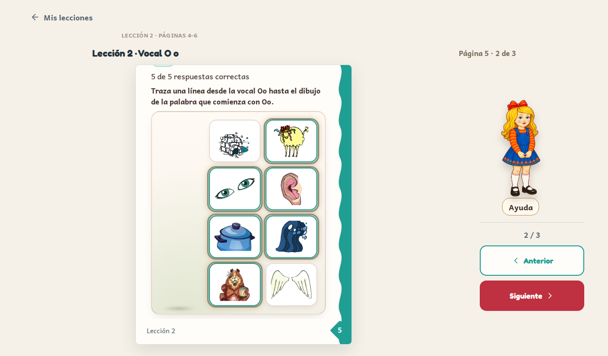

# PR #434 — Activity completion proof

Verified locally on 2 October 2026. No deployment or merge.

Final checks: 111 Vitest files passed; 1,369 tests passed plus two existing expected failures. Type checking and the Vite production build passed. Both Chromium browser checks passed.

- p2: direct picture tap, native button keyboard activation, five correct rows, saved answers and completion after reload.
- p5: ola is the printed example; five learner answers remain. Incorrect answer → Ayuda → assisted success. Partial save/reload, five-answer completion, former delayed-reset window, leave/return and completed reload all passed.
- Locked Siguiente explains unfinished work without hint events. An actually incomplete page stays locked.
- Targeted component tests verify multi-activity attribution, stale/unmounted encounter rejection, preserved child work and restored completion without fresh answer evidence.
- Review regressions cover malformed saved selections and a prior wrong-answer timer erasing a later correct choice.

Browser checks use `tests/e2e/activity-completion-foundation.spec.ts`. In this restricted execution environment the spec was compiled unchanged to CommonJS and run with Chromium headless shell using a separate browser worker for each test. No application dependency or standard Playwright configuration was changed.

## Shared-browser learner isolation

Post-review correction: activity selections, lasso/canvas work, circle selections,
writing responses, page/lesson completion and delivered assistance now use the
current classroom/student identity. Anonymous history stays anonymous. Changing
learner remounts the activity and invalidates stale callbacks; returning to the
original learner restores that learner's work.

Added regressions cover actual p5 A→B→A and anonymous→student transitions,
mounted writing/circle controls, assistance and lesson/page gates.
Final verification: 112 Vitest files; 1,375 passed and two existing expected
failures. Type checking, Vite build and both p2/p5 browser checks passed.
